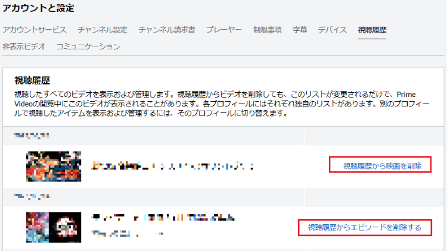

最近何となくですが、Amazon プライムビデオの視聴履歴をすべて削除したくなりました。人生にはいろいろリセットしたくなる時期というのがたまにありますよね。

## 視聴履歴を削除する方法

視聴履歴は、プライムビデオ > アカウントと設定 > 視聴履歴から削除できます。



「視聴履歴からエピソードを削除する」または「視聴履歴から映画を削除」をクリックすることで視聴履歴を削除できます。ただ一括削除はないんですよね。

私はプライムビデオと共に（主に怠惰な？）人生を歩んできたので、視聴履歴はかなりの量になっていました。これを 1 つずつ削除するというのは気がめいります。

## Playwright

最近、 [Playwright .NET](https://playwright.dev/dotnet/) を動かしてみたくてネタを探していたのでちょうどいいです。Playwright で自動化して一括削除することにします。

一応雑な説明をしておくと Playwright ブラウザ自動化ツールのことで似たようなものに [Selenium](https://www.selenium.dev/ja/) などがあります。Playwright は Python や Node.js、 Java などでも書けますが今回は .NET で書いてみます。

[Installation | Playwright .NET](https://playwright.dev/dotnet/docs/intro) を見ると、インストールに Microsoft.Playwright.NUnit などが指定されていますがこれはテストフレームワークも含まれているため、今回の用途では Microsoft.Playwright だけで十分です。

```bash
dotnet add package Microsoft.Playwright
```

## リモートデバッグ

今回はプライムビデオへのログインなどは自動化する必要がないので、あらかじめ視聴履歴ページを開いておいたブラウザにアタッチして操作することにします。

Playwright には [ConnectOverCDPAsync](https://playwright.dev/dotnet/docs/api/class-browsertype#browser-type-connect-over-cdp) というメソッドが用意されていて、Chrome DevTools Protocol を用いて起動済みブラウザにアタッチできます。ただし、使用可能なブラウザは Chromium ベースに限られます。まあ最近は Microsoft Edge も Chromium ベースなので困らなさそうです。

ブラウザはリモートデバッグを有効となるように `-remote-debugging-port{:bash}` オプションを付けて起動しておきます。

```bash
msedge -remote-debugging-port=9222
```

## 一括削除する

あとは、以下のような適当なコードを書いて実行するだけです。

```csharp
using var playwright = await Playwright.CreateAsync();
var browser = await playwright.Chromium.ConnectOverCDPAsync("http://localhost:9222"); // ブラウザにアタッチ
var page = browser.Contexts[0].Pages[0];
while (true)
{
    var buttonList = await page.GetByRole(AriaRole.Button, new() { Name = "視聴履歴から" }).AllAsync(); // てきとうに要素を探す
    if (buttonList is null || buttonList.Count == 0) break;
    foreach (var button in buttonList)
    {
        await button.ClickAsync();
    }
    await page.Mouse.WheelAsync(0, 1000); // てきとうにスクロール
    await page.WaitForTimeoutAsync(1000);
}
...
```

スクロールとか待機とかすごいてきとうですがだいたい削除できたのでよしとします。はじめて Playwright .NET を使いましたが結構気にいりました。また使ってみようと思います。

## 参考

- [技術/Chrome/Remote Debugging Protocol - Glamenv-Septzen.net](https://www.glamenv-septzen.net/view/1365)
