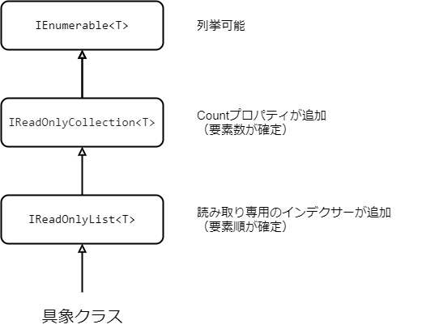

C#でコレクションをプロパティなどで公開するとき `List<T>`や配列のまま公開すると、中身が変更できてしまうため外部から意図しない変更が加えられる可能性があります。というかこういった公開のされ方がされていると「外部から変更してもいい」という意図を感じてしまうので、変更して欲しくない場合は読み取り専用でなるべく公開したいです。

でどうやって公開するのがいいんですかね～という話です。

## readonly なプロパティじゃだめ？

たとえば get-only プロパティを使えば readonly なプロパティを宣言できます。ただ、`List<T>`や配列のような参照型の場合、あくまで別のインスタンスで置き換えることができなくなるだけでコレクションの中身は相変わらず変更できてしまいます。

```csharp
public class Sample
{
    public List<int> Collection { get; }
    public Sample()
    {
        Collection = new List<int> { 1, 2, 3 };
    }
}

public void Test()
{
    var sample = new Sample();
    sample.Collection = new List<int> { 4, 5, 6 };　// これはダメ
    sample.Collection.Add(4); // これはOK
}
```

ということでコレクションを読み取り専用で公開する場合は単にプロパティを readonly にするだけでなく、`List<T>`や配列とは別の型を使おうという話になります。

## 変更できないコレクションを使う

.NET には変更できないコレクションとしてたとえば以下があります。

- [ReadOnlyCollection](https://learn.microsoft.com/ja-jp/dotnet/api/system.collections.objectmodel.readonlycollection-1)などの ReadOnly 系のコレクション
- [ImmutableList](https://learn.microsoft.com/ja-jp/dotnet/api/system.collections.immutable.immutablelist-1)などの Immutable 系のコレクション

### ReadOnly 系のコレクション

`ReadOnlyCollection<T>`は`IList<T>`をラップして`Add()`などの書き込み処理をできないようにしたコレクションです。

```csharp
var readOnlyCollection = (new List<int> { 1, 2, 3 }).AsReadOnly();
readOnlyCollection.Contains(1); // これはOK
readOnlyCollection.Add(4); // これはダメ
```

名前空間としては`System.Collections.ObjectModel`にあって、似たようなものとしては`ReadOnlyObservableCollection<T>`とか`ReadOnlyDictionary<TKey, TValue>`があります。

余談ですが、`ReadOnlyCollection<T>`は`ICollection<T>`を実装しているので実はたとえば`Add()`はあります。ただ[明示的なインターフェイスの実装](https://learn.microsoft.com/ja-jp/dotnet/csharp/programming-guide/interfaces/explicit-interface-implementation)とうい方法で通常は見えないようになっていて、`ICollection<T>`などのインターフェイスを介すことではじめて呼び出すことができます。もっとも呼び出しても NotSupportedException がスローされるだけなので中身が変更されることはないです。

```csharp
((ICollection<int>)readOnlyCollection).Add(4); // コンパイルエラーではないが実行時にNotSupportedException
```

ということで、`ReadOnlyCollection<T>`としてコレクションを公開すると次のようになります。

```csharp
public class Sample
{
    public ReadOnlyCollection<int> Collection { get; }
    public Sample()
    {
        var list = new List<int> { 1, 2, 3 };
        Collection = new ReadOnlyCollection<int>(list);
    }
}

public void Test()　
{
    var sample = new Sample();
    sample.Collection = new List<int> { 4, 5, 6 };　// これはダメ
    sample.Collection.Add(4); // これもダメ
}
```

しっかりコレクションの中身は変更できなくなっていて書き込み系の処理も（基本的には）コンパイルエラーになるので良いです。ちなみに、「.NET のクラスライブラリ設計」という.NET の開発者の方々が書かれた本を覗てみると次の用に書かれていたりします。

> 読み取り専用のコレクションを表すプロパティまたは戻り値には、`ReadOnlyCollection<T>`もしくはそのサブクラス、または、滅多にないケースだが、`IEnumerable<T>`を使用する。一般的には、`ReadOnlyCollection<T>`を推奨します。

とのことでここでは`ReadOnlyCollection<T>`が推奨されてるみたいです。

### Immutable 系のコレクション

変更できないコレクションとしてもう 1 つ代表的なのが`ImmutableList<T>`などの Immutable 系のコレクションだと思います。これは名前の通り「不変（イミュータブル）」なコレクションのことで「読み取り専用」とは少し違います。どういうことかというと、たとえば普通に`Add()`が呼び出せます。

```csharp
var immutableList1 = ImmutableList.Create(1, 2, 3);
var immutableList2 = immutableList1.Add(4); // 普通にAddできる、ただしimmutableList1は変更されない
```

このとき`immutableList1`の`Add()`を呼び出しても`immutableList1`は変更されず、`Add()`された結果は別インスタンスとして返されます。このように作成後にその状態が変わらない性質のことを[イミュータブル](https://ja.wikipedia.org/wiki/%E3%82%A4%E3%83%9F%E3%83%A5%E3%83%BC%E3%82%BF%E3%83%96%E3%83%AB)と呼びます。名前空間としては`System.Collections.Immutable`にあって、他にも`ImmutableArray<T>`とか`ImmutableDictionary<TKey, TValue>`などいろいろあります。

この`ImmutableList<T>`としてコレクションを公開するとたとえば次のようになります。

```csharp
public class Sample
{
    public ImmutableList<int> Collection { get; }
    public Sample()
    {
        Collection = ImmutableList.Create(1, 2, 3);
    }
}

public void Test()　
{
    var sample = new Sample();
    sample.Collection = ImmutableList.Create(4, 5, 6);　// これはダメ
    var newCollection = sample.Collection.Add(4); // これはOKだがample.Collectionは変更されない
}
```

当然コレクションの中身は変更できないんですが、前述したように普通に`Add()`などの書き込み系の処理を呼び出せるので「読み取り専用」という文脈においては違和感があります。今回の場合では基本的に`ReadOnlyCollection<T>`を使えば良いかなと思います。

## ReadOnly 系のインターフェイスを介して公開する

ReadOnly 系のインターフェイスを介して公開するという方法もあります。たとえば、`IEnumerable<T>`は LINQ などで出てくるのでよく知られていると思いますが、コレクションが列挙可能なことのみを定義するインターフェイスです。当然、`Add()`をはじめとした書き込み系の処理は定義されていないので、`IEnumerable<T>`を介せばそのコレクションは読み取り専用に見えます。

で.NET には （.NET Framework 4.5 あたりから）コレクションに対する読み取り処理のみを定義したインターフェイスが以下のように用意されています。



`IReadOnlyList<T>`では要素数や要素順を扱うことができ`IEnumerable<T>`や`IReadOnlyCollection<T>`よりも利便性が高いので、とくに理由がない限りは`IReadOnlyList<T>`を使うのが良さそうです。この`IReadOnlyList<T>`としてコレクションを公開するとたとえば次のようになります。

```csharp
public class Sample
{
    public IReadOnlyList<int> Collection { get; }
    public Sample()
    {
        Collection = new List<int> { 1, 2, 3 };
    }
}

public void Test()
{
    var sample = new Sample();
    sample.Collection = new List<int> { 4, 5, 6 };　// これはダメ
    sample.Collection.Add(4); // これもダメ
}
```

`List<T>`を`IReadOnlyList<T>`として公開することで中身を変更できなくなりました。ただ、あくまで`IReadOnlyList<T>`を介した状態では変更できないだけで、実体としては`List<T>`のままでたとえば以下のようにすれば中身は変更できます。

```csharp
((ICollection<int>)sample.Collection).Add(4); // これは大丈夫、中身を変更できてしまう
```

とは言っても`IReadOnlyList<T>`を実装した具象クラスが必ず`ICollection<T>`を実装している保証は（基本的に）ないわけで、これは普通はやっちゃいけない類の操作になると思います。なので、こういうケースについてはそこまで神経質にならなくてもいいと思います。結局、リフレクションを使えば何でもできてしまうわけだし。

## 結局どうすれば…？

ここまで変更できないコレクションを使ったり、読み取り専用のインターフェイスを介して公開したりしました。いずれの方法でも（一般的な操作の範囲で）コレクションを読み取り専用で公開できました。なので別にどの方法を使っても良いと思うのですが、一応よりベターなのはどういう方法なのか考えてみます。

こういうのは前提次第でいろいろ変わってくると思うのですが、今のところ一番ベターかなと思っているのは「**とりあえず`IReadOnlyList<T>`で公開しておいて必要に応じて内部実装を変更する**」です。

```csharp
public class Sample
{
    public IReadOnlyList<int> Collection { get; }
    public Sample()
    {
        Collection = new List<int> { 1, 2, 3 }; // List<T>でもいいし
        Collection = new int[] { 1, 2, 3 }; // 配列でもいいし
        Collection = new List<int> { 1, 2, 3 }.AsReadOnly(); // ReadOnlyCollection<T>でもいいし
        Collection = ImmutableList.Create(1, 2, 3); // ImmutableList<T>でもいい
    }
}
```

`IReadOnlyList<T>`で公開しておけば内部で使う型は後から変更できます。たぶん一般的な用途であれば内部実装は`List<T>`や配列で十分な気がします。より堅牢な設計が必要なら`ReadOnlyCollection<T>`としてラップすると良いと思います。

（そんなにないケースだと思うのですが）内部実装上イミュータブルであることに意味があるなら`ImmutableList<T>`を使うのも１つの手です。また、将来より便利な`IReadOnlyList<T>`を実装した別のコレクションを内部実装に使えるかもしれないです。

ようするに内部実装を「先延ばし」にできます。「先延ばし」と書くとなんかあまり良くないことな気がしますが、いったん具象クラスで公開してしまうと他の実装に変更することは難しくなります。ソフトウェアは日々進歩するものだと思うので、公開している API を変えずに内部実装を変えられるのはとても良いことかなと思います。

## パフォーマンスが気になる場合

インターフェイスを介すると一般的にパフォーマンスが落ちます。これは仮想呼び出しのオーバーヘッドがあるからであったりインライン化できないであったりまあいろいろあると思います。

そうすると「`IReadOnlyList<T>`を介して`ReadOnlyCollection<T>`を公開する」のではなく「`ReadOnlyCollection<T>`として公開する」方が良いのではという話が出てきそうです。ただ、実はこの 2 つについてパフォーマンスにあまり差はなかったりします。

| Method                      |     Mean |    Error |   StdDev |
| --------------------------- | -------: | -------: | -------: |
| ReadOnlyCollectionBenchmark | 71.51 ns | 0.768 ns | 0.719 ns |
| IReadOnlyListBenchmark      | 72.62 ns | 0.732 ns | 0.684 ns |

```csharp
public class Sample
{
    public int[] Array { get; }
    public ReadOnlyCollection<int> ReadOnlyCollection { get; }
    public IReadOnlyList<int> IReadOnlyList { get; }
    public Sample()
    {
        var N = 10^6;
        Array = Enumerable.Range(1, N).ToArray();
        ReadOnlyCollection = new ReadOnlyCollection<int>(Array);
        IReadOnlyList = Array;
    }
}

[Benchmark]
public int ReadOnlyCollectionBenchmark()
{
    var sample = new Sample();
    int sum = 0;
    foreach (var item in sample.ReadOnlyCollection)
    {
        sum += item;
    }
    return sum;
}
[Benchmark]
public int IReadOnlyListBenchmark()
{
    var sample = new Sample();
    int sum = 0;
    foreach (var item in sample.IReadOnlyList)
    {
        sum += item;
    }
    return sum;
}
```

これは`ReadOnlyCollection<T>`の内部実装が`IList<T>`を介した呼び出しになっているためです。つまり`ReadOnlyCollection<T>`の場合は`IReadOnlyList<T>`を介しているかどうかはあまり差になりません。パフォーマンスを気にする場合、`ReadOnlyCollection<T>`が遅いのは覚えておいても良いかもしれないです。

ちなみに`List<T>`なんかは実装が工夫されているので、インターフェイスを介するより`List<T>`のままの方がパフォーマンスは良いです。とはいえ、`List<T>`のまま公開すると読み取り専用ではなくなってしまいますが…。

で、そこまでパフォーマンスを気にする局面では大人しく[ReadOnlySpan](https://learn.microsoft.com/ja-jp/dotnet/api/system.readonlyspan-1)として公開するのが良いと思います。

| Method                |     Mean |    Error |   StdDev |
| --------------------- | -------: | -------: | -------: |
| ArrayBenchmark        | 27.68 ns | 0.571 ns | 0.680 ns |
| ReadOnlySpanBenchmark | 27.47 ns | 0.453 ns | 0.423 ns |

```csharp
public class Sample
{
    public int[] Array { get; }
    public ReadOnlySpan<int> ReadOnlySpan => Array;
    public Sample()
    {
        var N = 10^6;
        Array = Enumerable.Range(1, N).ToArray();
    }
}

[Benchmark]
public int ArrayBenchmark()
{
    var sample = new Sample();
    int sum = 0;
    foreach(var item in sample.Array)
    {
        sum += item;
    }
    return sum;
}
[Benchmark]
public int ReadOnlySpanBenchmark()
{
    var sample = new Sample();
    int sum = 0;
    foreach (var item in sample.ReadOnlySpan)
    {
        sum += item;
    }
    return sum;
}

```

`ReadOnlySpan<T>`は`Span<T>`の読み取り専用版で、`Span<T>`は配列のような連続したメモリ領域を表す構造体です。なので、データの集合を抽象化した`IEnumerable<T>`を実装したコレクションとは少し違った概念になります。

`ReadOnlySpan<T>`だと、LINQ などは使用できませんが、読み取り専用にしたうえで配列を直接公開した場合と変わらないパフォーマンスを出せます。

## 終わりに

（本題とはあんまり関係ないんですが）引用した「.NET のクラスライブラリ設計」に以下のようなことも書いてありました。

> Count プロパティにアクセスするという目的だけで、パラメーターを `ICollection<T>`または `ICollection` にすることを避ける。代わりに、 `IEnumerable<T>` または `IEnumerable` を使用して、そのオブジェクトが `ICollection<T>` または `ICollection` を実装しているかどうかを動的にチェックすることを検討する。

これって`IReadOnlyCollection<T>`で解決するような気がします。新装版なので.NET Framework 4.5 が出てから更新されていると思うのですが、この辺更新されない理由って何かあったりするんでしょうか…。

## 参考

- [【C#】IReadOnlyListT と ReadOnlyCollectionT と ImmutableListT の違い #初心者 - Qiita](https://qiita.com/yutorisan/items/3f5fdb1495be03e56d3c)
- [foreach の掛け方いろいろ](https://ufcpp.net/blog/2018/12/howtoenumerate/)
- [.NET のクラスライブラリ設計 改訂新版 (マイクロソフト関連書)](https://www.amazon.co.jp/NET%E3%81%AE%E3%82%AF%E3%83%A9%E3%82%B9%E3%83%A9%E3%82%A4%E3%83%96%E3%83%A9%E3%83%AA%E8%A8%AD%E8%A8%88-%E3%83%9E%E3%82%A4%E3%82%AF%E3%83%AD%E3%82%BD%E3%83%95%E3%83%88%E9%96%A2%E9%80%A3%E6%9B%B8-Krzysztof-Cwalina%E3%80%81Jeremy-Barton%E3%80%81Brad/dp/4296080040)
